<p align="center">
  <a href="https://mhshaon98.github.io/agent-skills/">
    
  </a>
</p>

<p align="center">
  <a href="https://mhshaon98.github.io/agent-skills/"><b>Browse the catalog →</b></a>
  &nbsp;·&nbsp;
  <a href="AGENTS.md">For agents: AGENTS.md</a>
  &nbsp;·&nbsp;
  <a href="skills.json">skills.json</a>
  &nbsp;·&nbsp;
  <a href="llms.txt">llms.txt</a>
</p>

<p align="center"><sub><!-- stats -->Last updated: 2026-10-06 · 23 skills · 11 playbooks<!-- /stats --></sub></p>

# Agent Skills Catalog

Field-tested [Claude Code](https://code.claude.com/docs/en/skills) skills in the
`SKILL.md` format: small, load-on-demand instruction packs that give a coding agent
engineering discipline for session continuity, verification, data safety, release
review, delegation, formatting and auditing. The same folders also work with
[OpenAI Codex CLI](https://github.com/openai/codex) from `$CODEX_HOME/skills`.

## Share with a coworker

Send them this repo link and pick whichever route suits them. All three install only
the skills they choose, and none of them overwrite an existing skill without asking.

**1. Paste this to your agent** (Claude Code, Codex CLI, or any agent with shell access):

```text
Read https://raw.githubusercontent.com/mhshaon98/agent-skills/main/AGENTS.md and follow it:
list the skills in that catalog grouped by category, ask me which ones I want,
then install only those. Don't overwrite any skill I already have without asking.
```

**2. Claude Code plugin marketplace** (installs, updates and uninstalls through `/plugin`):

```text
/plugin marketplace add mhshaon98/agent-skills
/plugin install verify-work@dev-discipline     # one skill...
/plugin install safety-pack@dev-discipline     # ...or a whole category (not both)
```

Pick one route per skill: a plugin copy and a plain `~/.claude/skills` copy of the same
skill both load.

Every skill is its own plugin (`<skill>@dev-discipline`), and each category has a bundle
(`workflow-pack`, `safety-pack`, `delegation-pack`, `formatting-pack`, `tooling-pack`).
Plugin skills are namespaced, so `verify-work` runs as `/verify-work:verify-work`. Run
`/plugin` with no arguments to browse everything. The marketplace is called
`dev-discipline` because Claude Code reserves the name `agent-skills`.

**3. One-line install** (no git clone needed; copies plain skill folders into `~/.claude/skills/`):

```bash
# macOS / Linux / Git Bash: name the skills you want, or leave them out for a menu
curl -fsSL https://raw.githubusercontent.com/mhshaon98/agent-skills/main/install.sh | bash -s -- verify-work security-pass
curl -fsSL https://raw.githubusercontent.com/mhshaon98/agent-skills/main/install.sh | bash -s -- --list
```

```powershell
# Windows PowerShell: set AGENT_SKILLS to the skills you want, or leave it unset for a menu
$env:AGENT_SKILLS = "verify-work,security-pass"; irm https://raw.githubusercontent.com/mhshaon98/agent-skills/main/install.ps1 | iex
```

New skills load the next time the agent starts a session.

## Installer reference

From a clone, or piped from the URLs above (`bash -s -- <args>`):

```bash
./install.sh                          # menu: lists the catalog, installs what you pick
./install.sh verify-work spawn-agent  # install named skills
./install.sh --list                   # print the catalog and exit
./install.sh --all                    # install everything
./install.sh --codex                  # install into ${CODEX_HOME:-~/.codex}/skills
./install.sh --project                # install into ./.claude/skills (this project only)
./install.sh --dest DIR               # install into any folder
./install.sh --force                  # replace same-name skills (old copy is backed up, never deleted)
```

PowerShell takes the same options as parameters (`.\install.ps1 -Names verify-work,spawn-agent`,
`-List`, `-All`, `-Codex`, `-Project`, `-Dest`, `-Force`) or, when piped through `iex`,
as environment variables: `AGENT_SKILLS` (names, comma or space separated, or `all`),
`AGENT_SKILLS_LIST=1`, `AGENT_SKILLS_CODEX=1`, `AGENT_SKILLS_PROJECT=1`,
`AGENT_SKILLS_FORCE=1`, `AGENT_SKILLS_DEST`.

Some skills are written for one agent only (marked *Codex CLI only* or *Claude Code only*
in the catalog, `targets` in `skills.json`). The installers skip a skill that does not fit
the target agent: install a Codex-only skill with `--codex` / `-Codex`.

When a skill with the same name already exists, the installers ask before replacing it,
and skip it when there is no one to ask. Replacing a skill (with `--force` / `-Force`, or by
answering yes) first moves the old copy to a `-backup` folder next to the skills folder,
for example `~/.claude/skills-backup/`. Each installed skill gets a small
`.agent-skills.json` stamp holding its catalog `version`; re-run the installer to update,
and it tells you which installed skills have a newer version.

Requirements: `bash` 3.2 or later with `curl` (or `wget`), plus `python3` (or a Python 3
`python`) or `node` to read the JSON manifest. PowerShell 5.1 or later on Windows.

Skill front-matter: every skill has `name` and `description`, which Claude Code and Codex
CLI both read. A few skills add Claude Code-specific keys (`argument-hint`, `context`,
`background`, `model`, `disable-model-invocation`); other agents ignore them.

## Catalog

The tables below are generated from [`skills.json`](skills.json), the source of truth.
Each skill links to its `SKILL.md`.

<!-- catalog:start (generated by scripts/build-catalog.py, do not edit) -->

### Workflow

Session continuity: start, hand off, track bugs, bootstrap projects. Bundle: `workflow-pack@dev-discipline`.

| Skill | What it does | Files |
| --- | --- | --- |
| [bug-ledger](skills/bug-ledger/SKILL.md) | Use when a bug is reported, found, fixed, or reopened, or before working in a bug-prone area. Check BUG_LIST.md before debugging: many "new" bugs are regressions of fixed ones. | 1 |
| [call-handoff](skills/call-handoff/SKILL.md) | Cold-start briefing from the project's newest handoff, open bugs and next-session prompt in two round-trips, then stop. Use at session start or on "call handoff", "catch up", "where did we leave off". | 2 |
| [new-project](skills/new-project/SKILL.md) | Bootstrap a brand-new project with proven architecture defaults and continuity scaffolding. Use when starting a new project from scratch, or when touching a legacy project that has no handoff/git/structure yet. | 1 |
| [session-start](skills/session-start/SKILL.md) | Old name for the session-start ritual, which now lives in call-handoff; run that skill instead. | 1 |
| [update-handoff](skills/update-handoff/SKILL.md) | End-of-session wrap in one pass: a DETAILED handoff (always; depth scales with how much the session did, nothing in context is allowed to slip), lessons, memory, bug ledger and NEXT-SESSION-PROMPT.md. Use on "update handoff", "wrap up", "end the session", or before context runs out. | 2 |

### Safety

Verification, data safety, security and release gates. Bundle: `safety-pack@dev-discipline`.

| Skill | What it does | Files |
| --- | --- | --- |
| [app-audit](skills/app-audit/SKILL.md) | Automated technical and disclosure compliance-assistance audit of a project: profiling, read-only specialist subagents, fresh research, optional Codex peer review, one consolidated report. Use on /app-audit, "audit this app", or a pre-launch security/privacy/store check. | 110 |
| [compliance-check](skills/compliance-check/SKILL.md) | Live compliance close-out: checks what is actually live (store listing and labels, published policies, deployed backend, retention and deletion jobs) against the code and the published words, then works the remediation runbook. Use on /compliance-check, "what's left on compliance", "close out the audit", or before a store submission. | 9 |
| [pre-release-review](skills/pre-release-review/SKILL.md) | Independent fresh-context review before anything ships. Use on "ship it", "release", "submit", "deploy", "push to production", before any production push, and after a large diff, even when the diff looks fine. | 1 |
| [safe-data-write](skills/safe-data-write/SKILL.md) | Use before any write, migration, or deletion touching user data: stores, schemas, user-owned files (Excel workbooks, databases, documents). Backup, audit and rollback rules learned from shipped data-loss bugs. | 1 |
| [security-pass](skills/security-pass/SKILL.md) | Use when touching auth, API keys, secrets, RLS/policies, payment or personal data, any new endpoint that writes, or live backends — and before any release. Security and secrets checklist; every rule traces to a real production finding. | 1 |
| [verify-work](skills/verify-work/SKILL.md) | Use before claiming work is done, working, or fixed, and before writing a handoff or completion summary. Verification ladder plus the Verified/NOT-verified ledger. | 1 |

### Delegation

Subagents, model routing, and second opinions from other providers. Bundle: `delegation-pack@dev-discipline`.

| Skill | What it does | Files |
| --- | --- | --- |
| [antigravity-bridge](skills/antigravity-bridge/SKILL.md) | Delegate bounded work or get a third-provider opinion from Google's Antigravity CLI (agy, Gemini). Use on "ask antigravity", "ask gemini", "send this to agy", as a Claude-vs-Codex tie-breaker, or for cheap bounded research sweeps. | 3 |
| [astra-conductor](skills/astra-conductor/SKILL.md) | Operating mode for the ENTIRE session whenever the session model is GPT-6-Astra: Astra acts only as architect/orchestrator, delegates ALL execution to gpt-5.6/5.4/5.3 subagents via spawn_agent, and verifies end-to-end. *(Codex CLI only)* | 1 |
| [codex-bridge](skills/codex-bridge/SKILL.md) | Delegate a task to OpenAI Codex or get a non-Claude second review via the codex plugin. Use on "ask codex", "have codex review/check this", "send to codex", or before a release when a second provider is worth it. *(Claude Code only)* | 4 |
| [cowork-relay](skills/cowork-relay/SKILL.md) | Split work between Claude Cowork and Claude Code on one project: each side does all it can and ends with a copy-paste relay prompt for the other. Use in a Cowork session or when a RELAY prompt is pasted. | 1 |
| [fable-conductor](skills/fable-conductor/SKILL.md) | Session-long operating mode when the session model is Fable/Mythos-class: Fable plans, briefs and verifies; execution is delegated to Opus/Sonnet/Haiku subagents. *(Claude Code only)* | 1 |
| [spawn-agent](skills/spawn-agent/SKILL.md) | Use BEFORE spawning any subagent (research, implementation, review, debugging) or choosing a model for delegated work. Gate, brief-writing procedure, and model-tier routing; usage limits are a real budget. | 1 |

### Formatting

Readable output and AI-slop cleanup. Bundle: `formatting-pack@dev-discipline`.

| Skill | What it does | Files |
| --- | --- | --- |
| [apply-richformat](skills/apply-richformat/SKILL.md) | Give any text-bearing surface (app screen, document, report, README, chat answer, CLI output, table) visible rank and separation. Use when building or reviewing one, or on "rich formatting", "text vomit", "needs better structure", "make this readable". | 1 |
| [doc-metadata](skills/doc-metadata/SKILL.md) | Stamp the project's chosen author and company on every Word, Excel, PowerPoint or PDF file the agent creates or edits, and strip tool and AI fingerprints such as "python-docx" or "generated by". Asks the user once per project which identity to use; also on /doc-metadata or "fix the metadata". | 2 |
| [slop-clean](skills/slop-clean/SKILL.md) | Project-wide sweep that removes heavy AI slop from design and copy while keeping deliberate, evidenced creative choices (bold colour, density, texture, voice). Manual only (/slop-clean [path]); never self-trigger. | 1 |

### Tooling

Task-specific tools: CMS layer, process logging, usage reports. Bundle: `tooling-pack@dev-discipline`.

| Skill | What it does | Files |
| --- | --- | --- |
| [client-cms](skills/client-cms/SKILL.md) | Add a secure client-facing admin/content layer to the current website so nontechnical staff can edit approved content without touching source. Use on /client-cms, "add an admin panel", or when the user wants site content editable by a client or business owner. | 2 |
| [commissioning-logger](skills/commissioning-logger/SKILL.md) | Only when explicitly asked to log a multi-step hands-on process (commissioning, wiring, bring-up, troubleshooting): "log this", "start a commissioning log", "write it up as we go". Keeps log.md plus a Word doc with annotated screenshots. | 5 |
| [usage-here](skills/usage-here/SKILL.md) | Report what this session cost: tokens and dollars by model, share of the 5-hour and weekly limits, top three prompts. Use on "usage here", "what did this session cost", "how much have I burned", "token usage", or questions about limits mid-session. | 4 |

<!-- catalog:end -->

## Playbooks

[`playbooks/`](playbooks/README.md) holds longer reference docs the skills lean on:
architecture defaults, verification, security, model and agent strategy, token
efficiency, Cloudflare cost safety, and Remotion video recipes. Agents read the relevant
one on demand; nothing is installed. See the [playbooks index](playbooks/README.md).

## What a skill is

A skill is a directory with a `SKILL.md` at its root. The file starts with YAML
front-matter (a `name`, and a `description` that tells the agent *when* to reach for it),
followed by the instructions. Some skills carry extra files such as scripts, templates
or references next to the `SKILL.md`.

- **Loads on demand.** The agent reads a skill's body only when the task matches its
  description, so a large catalog costs almost nothing until it is needed.
- **Installing is copying the folder.** `skills/<name>/` goes to `~/.claude/skills/<name>/`
  (Windows: `%USERPROFILE%\.claude\skills\<name>\`) or `~/.codex/skills/<name>/`. There is
  no build step; the agent discovers it next session.

## Related upstream skills

Third-party skills that pair well with this catalog. They are not vendored here; install
them from their own repos.

- [remotion-dev/skills](https://github.com/remotion-dev/skills): the recommended video framework for programmatic React video, captions and rendering (`npx skills add remotion-dev/skills`).
- [last30days](https://github.com/mvanhorn/last30days-skill): broad multi-source social-sentiment research over the last 30 days.
- [defuddle skill](https://github.com/kepano/obsidian-skills): extract clean markdown from web pages, token-efficiently.
- [agent-browser](https://github.com/vercel-labs/agent-browser): browser-automation CLI built for AI agents.
- [impeccable](https://github.com/pbakaus/impeccable): design-system craft skill for frontend UI work.
- [taste-skill](https://github.com/Leonxlnx/taste-skill): UX/UI and motion-engineering taste.
- [design-motion-principles](https://github.com/kylezantos/design-motion-principles): build or audit UI motion with intent.

## Maintaining the catalog

`skills.json`, `.claude-plugin/marketplace.json`, `llms.txt` and the catalog tables above
are generated. After adding or editing a skill, run `python3 scripts/build-catalog.py`
(and `--check` before opening a PR). See [CONTRIBUTING.md](CONTRIBUTING.md).

## License

[MIT](LICENSE). Use, copy, and adapt freely.
